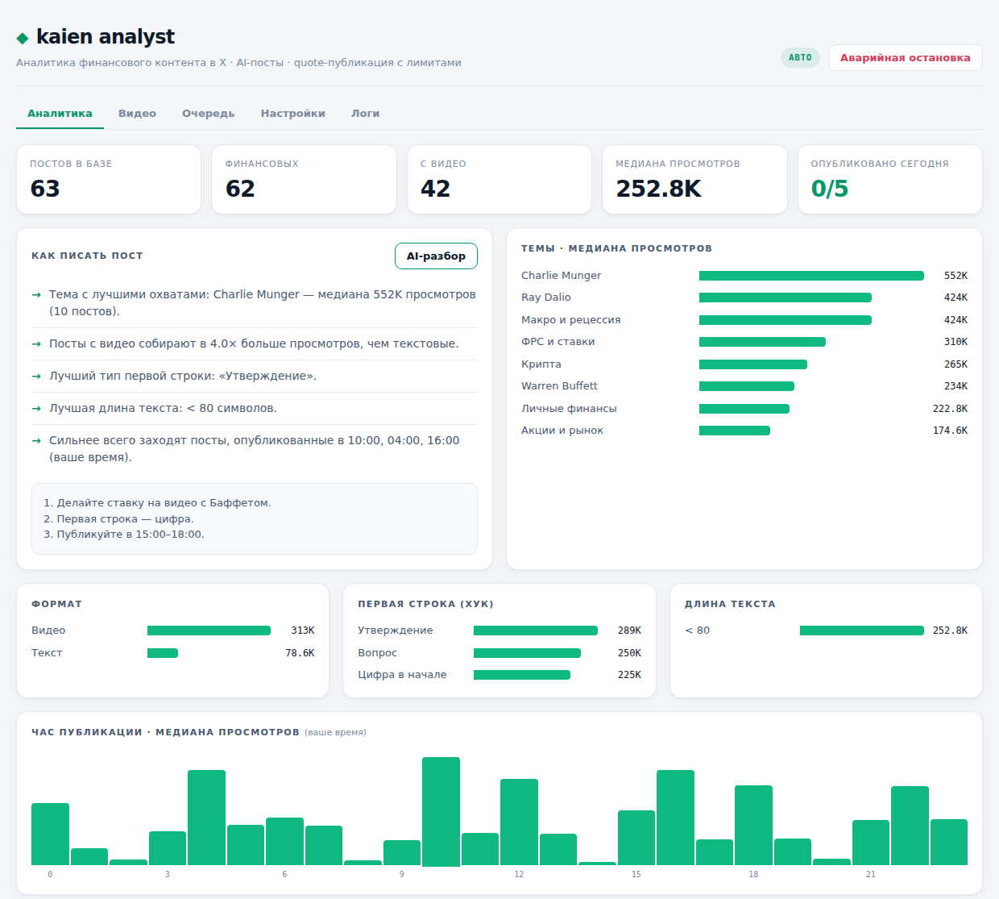
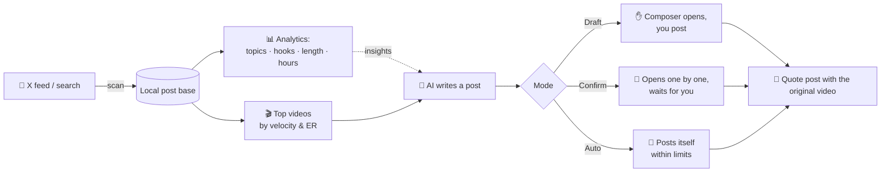
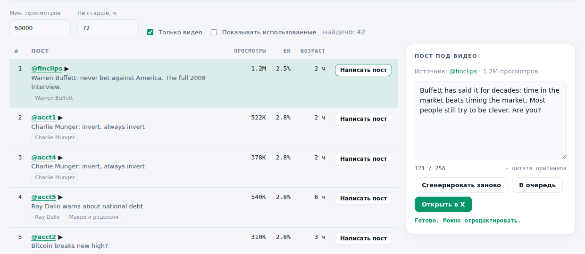

<div align="center">

# ◆ kaien analyst

**Finance content analytics for X, right in your browser.<br>Find what performs → pick the hottest video → AI writes the post → publish as a quote.**

[](https://developer.chrome.com/docs/extensions/mv3/)
[](#)
[](https://openrouter.ai)
[](#-tests)
[](LICENSE)
[](manifest.json)

[🇷🇺 Русский](README.ru.md) · **🇬🇧 English**

[Features](#-features) · [How it works](#-how-it-works) · [Installation](#-installation) · [Modes](#%EF%B8%8F-modes) · [Structure](#-project-structure)



<sub>Dashboard with demo data</sub>

</div>

---

## ✨ Features

| | |
|---|---|
| 📊 **Niche analytics** | Collects finance posts from your X feed and search: views, likes, reposts, bookmarks, engagement |
| 🏷️ **Topics & speakers** | Buffett, Munger, Dalio, Burry, the Fed, inflation, stocks, crypto, gold, real estate… plus your own keywords |
| ✍️ **"How to write a post"** | Which topics, first-line hooks, text length and posting hours get the most views — plus an AI breakdown |
| 🎬 **Top videos** | Ranks videos by view velocity and engagement, with filters for minimum views and age |
| 🤖 **AI post writer** | Writes a post in your account's voice: hook, insight in your own words, takeaway. Checks X length limits |
| 🔁 **Quote publishing** | The original video is embedded via a quote post — the author gets credit, your post gets the reach |
| 🎛️ **3 modes** | Draft → Confirm → Automatic (autopilot with daily cap, delays and active hours) |
| 🛑 **Emergency stop** | One button stops the queue, the autopilot and any open composer |
| 📁 **CSV export** | Download everything collected for your own analysis |

## 🔄 How it works



1. Open x.com and click **"Финансовые видео"** (Finance videos) in the `[ KAIEN ANALYST ]` panel — it opens a ready-made search (Buffett, Munger, Dalio, investing, inflation… `filter:videos`).
2. Click **"Сканировать"** (Scan): the extension scrolls and saves posts with their metrics. Your normal browsing is collected too.
3. The **Analytics** tab shows what works in the niche; the **Videos** tab shows the hottest clips right now.
4. Click **"Написать пост"** (Write post) — AI drafts a post; edit it if you want.
5. **"Открыть в X"** (Open in X) opens the composer with your text and the original video attached as a quote.

> [!NOTE]
> The extension **does not download or re-upload other people's videos**. Re-uploading clips (e.g. CNBC interviews) leads to copyright strikes and account restrictions; a quote post keeps the video, credits the author and is safe for the account.

## 🎛️ Modes

| Mode | What happens | Publishing |
|---|---|---|
| 📝 **Draft** (`Черновик`) | Opens the X composer with text + quote | You click "Post" |
| 👀 **Confirm** (`Подтверждение`) | Goes through the queue one post at a time | You confirm each post |
| 🚀 **Automatic** (`Автоматический`) | Autopilot: picks the top video, writes and publishes a post; scans search by itself when out of candidates | Automatic, within limits |

Default limits: **5 posts/day**, **45–120 min** between posts, active hours **9:00–22:00**, 5–12 s pause before sending. Every video is used only once.

## 🚀 Installation

1. **Download:** green **Code → Download ZIP** button, then unzip.
2. **Key:** create an OpenRouter API key — <https://openrouter.ai/settings/keys> (the free router works).
3. Open `chrome://extensions` and enable **Developer mode**.
4. **Load unpacked** → select the folder containing `manifest.json`.
5. Extension icon → **"Открыть дашборд"** (Open dashboard) → **Настройки** (Settings) → **"OpenRouter Free"** → paste the key → **Save**.
6. Set your handle, post language (English by default) and length (280 or 4000 for X Premium).

> [!TIP]
> Collect at least 50–100 finance posts before trusting the analytics, and start in **Draft** mode.

<div align="center"><br><sub>Top videos and the post editor (demo data)</sub></div>

## ⚙️ Settings

<details>
<summary><b>AI provider</b></summary>

```text
Endpoint: https://openrouter.ai/api/v1
Path:     /chat/completions
Model:    openrouter/free
```

Any OpenAI-compatible API works, including a local model on `http://127.0.0.1:<port>`.
The API key is stored only in `chrome.storage.local` and never written to logs.

</details>

<details>
<summary><b>Account style (prompt)</b></summary>

The default prompt describes the @kaienphase voice: calm, sharp, practical; a strong hook, 1–3 lines of insight, a takeaway or a question; no invented quotes or numbers; at most one hashtag and one emoji. Edit it under **Settings → AI**.

</details>

<details>
<summary><b>How videos are ranked</b></summary>

`score = views / age_hours^0.8 × (1 + 10 × ER)`, where ER = (likes + reposts + replies + bookmarks) / views. Fresh videos that are growing fast and have high engagement rise to the top. Filters: minimum views, max age, video only, your own posts excluded, already used videos hidden.

</details>

## 📁 Project structure

```text
kaien-analyst/
├── manifest.json        # Manifest V3
├── package.json         # npm test / npm run check
├── src/
│   ├── background.js    # service worker: AI, post base, queue, autopilot (alarms)
│   ├── content.js       # on x.com: collects posts & metrics, panel, composer automation
│   ├── domain.js        # pure logic: metric parsing, topics, hooks, stats, ranking, limits
│   ├── options.html/js  # dashboard: analytics, videos, queue, settings, logs
│   ├── popup.html/js    # quick popup
│   └── styles.css       # light & dark theme
├── tests/
│   └── domain.test.js   # unit tests with node:test
└── docs/                # screenshots
```

## 🧪 Tests

```bash
npm test        # unit tests
npm run check   # syntax check of all scripts
```

Requires Node.js 18+; no external dependencies.

## ⚠️ Important

- Metrics are read from X's page layout. X changes it often — if numbers stop updating, check the **Logs** tab.
- Automated posting is subject to the [X automation rules](https://help.x.com/en/rules-and-policies/x-automation). Keep limits moderate and review what the AI writes.
- AI can be wrong. Nothing here is financial advice — check facts before publishing.

## 📄 License

[MIT](LICENSE)
