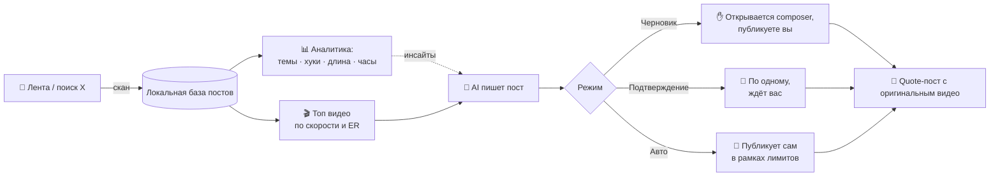

<div align="center">

# ◆ kaien analyst

**Аналитика финансового контента в X прямо в браузере.<br>Узнай, что заходит → возьми самое горячее видео → AI напишет пост → опубликуй цитатой.**

[](https://developer.chrome.com/docs/extensions/mv3/)
[](#)
[](https://openrouter.ai)
[](#-тесты)
[](LICENSE)
[](manifest.json)

**🇷🇺 Русский** · [🇬🇧 English](README.md)

[Возможности](#-возможности) · [Как это работает](#-как-это-работает) · [Установка](#-установка) · [Режимы](#%EF%B8%8F-режимы) · [Структура](#-структура-проекта)


<sub>Дашборд на демо-данных</sub>

</div>

---

## ✨ Возможности

| | |
|---|---|
| 📊 **Аналитика ниши** | Собирает финансовые посты из ленты и поиска X: просмотры, лайки, репосты, закладки, вовлечённость |
| 🏷️ **Темы и спикеры** | Баффет, Мангер, Далио, Бьюрри, ФРС, инфляция, акции, крипта, золото, недвижимость… и ваши ключевые слова |
| ✍️ **«Как писать пост»** | Какие темы, первые строки, длина текста и часы публикации дают больше просмотров, плюс AI-разбор |
| 🎬 **Топ видео** | Рейтинг роликов по скорости набора просмотров и вовлечённости, фильтры по просмотрам и возрасту |
| 🤖 **AI пишет пост** | В стиле вашего аккаунта: хук, мысль своими словами, вывод. Проверяет лимит символов X |
| 🔁 **Публикация цитатой** | Оригинальное видео встраивается через quote-пост: автору — упоминание, вашему посту — охват |
| 🎛️ **3 режима** | Черновик → Подтверждение → Автоматический (автопилот с дневным лимитом, паузами и активными часами) |
| 🛑 **Аварийная остановка** | Одна кнопка останавливает очередь, автопилот и открытый composer |
| 📁 **Экспорт CSV** | Всё собранное можно выгрузить для своего анализа |

## 🔄 Как это работает



1. Откройте x.com и нажмите **«Финансовые видео»** в панели `[ KAIEN ANALYST ]`. Откроется готовый поиск (Buffett, Munger, Dalio, investing, inflation… `filter:videos`).
2. Нажмите **«Сканировать»**: расширение прокрутит ленту и сохранит посты с метриками. Посты из обычного просмотра ленты тоже собираются.
3. Во вкладке **«Аналитика»** видно, что заходит в нише, во вкладке **«Видео»** — самые горячие ролики прямо сейчас.
4. **«Написать пост»** — AI подготовит текст, его можно поправить.
5. **«Открыть в X»** — откроется окно публикации с вашим текстом и оригинальным видео в цитате.

> [!NOTE]
> Расширение **не скачивает и не перезаливает чужие видео**. Перезалив роликов (например, интервью CNBC) приводит к страйкам за авторские права и ограничениям аккаунта. Quote-пост сохраняет видео, указывает автора и безопасен для аккаунта.

## 🎛️ Режимы

| Режим | Что происходит | Публикация |
|---|---|---|
| 📝 **Черновик** | Открывает окно X с текстом и цитатой | Нажимаете «Опубликовать» сами |
| 👀 **Подтверждение** | Проходит очередь по одному посту | Подтверждаете каждый пост |
| 🚀 **Автоматический** | Автопилот: берёт топ-видео, пишет и публикует пост; если кандидатов нет — сам сканирует поиск | Сама, в рамках лимитов |

Лимиты по умолчанию: **5 постов в день**, **45–120 минут** между постами, активные часы **9:00–22:00**, пауза 5–12 с перед отправкой. Каждое видео используется только один раз.

## 🚀 Установка

1. **Скачать:** зелёная кнопка **Code → Download ZIP**, распаковать.
2. **Ключ:** создать API key в OpenRouter — <https://openrouter.ai/settings/keys> (бесплатный роутер подходит).
3. Открыть `chrome://extensions` и включить **Developer mode**.
4. **Load unpacked** → выбрать папку, где лежит `manifest.json`.
5. Иконка расширения → **«Открыть дашборд»** → **Настройки** → **«OpenRouter Free»** → вставить ключ → **«Сохранить настройки»**.
6. Указать свой ник, язык постов (по умолчанию английский) и длину (280 или 4000 для X Premium).

> [!TIP]
> Соберите хотя бы 50–100 финансовых постов, прежде чем доверять аналитике, и начните с режима **Черновик**.

<div align="center"><br><sub>Топ видео и редактор поста (демо-данные)</sub></div>

## ⚙️ Настройки

<details>
<summary><b>AI-провайдер</b></summary>

```text
Endpoint: https://openrouter.ai/api/v1
Path:     /chat/completions
Model:    openrouter/free
```

Подходит любой OpenAI-совместимый API, в том числе локальная модель на `http://127.0.0.1:<порт>`.
API key хранится только в `chrome.storage.local` и не пишется в логи.

</details>

<details>
<summary><b>Стиль аккаунта (prompt)</b></summary>

Стандартный prompt описывает голос @kaienphase: спокойно, точно, по делу; сильная первая строка, 1–3 строки сути, вывод или вопрос; никаких выдуманных цитат и цифр; максимум один хэштег и один эмодзи. Меняется в **Настройки → AI**.

</details>

<details>
<summary><b>Как ранжируются видео</b></summary>

`score = просмотры / возраст_в_часах^0.8 × (1 + 10 × ER)`, где ER = (лайки + репосты + ответы + закладки) / просмотры. Наверх поднимаются свежие ролики, которые быстро набирают просмотры и хорошо вовлекают. Фильтры: минимум просмотров, максимальный возраст, только видео, без ваших постов, без уже использованных.

</details>

## 📁 Структура проекта

```text
kaien-analyst/
├── manifest.json        # Manifest V3
├── package.json         # npm test / npm run check
├── src/
│   ├── background.js    # service worker: AI, база постов, очередь, автопилот (alarms)
│   ├── content.js       # на x.com: сбор постов и метрик, панель, работа с composer
│   ├── domain.js        # чистая логика: парсинг метрик, темы, хуки, статистика, рейтинг, лимиты
│   ├── options.html/js  # дашборд: аналитика, видео, очередь, настройки, логи
│   ├── popup.html/js    # быстрое окно
│   └── styles.css       # светлая и тёмная тема
├── tests/
│   └── domain.test.js   # unit-тесты на node:test
└── docs/                # скриншоты
```

## 🧪 Тесты

```bash
npm test        # unit-тесты
npm run check   # проверка синтаксиса всех скриптов
```

Нужен Node.js 18+; внешних зависимостей нет.

## ⚠️ Важно

- Метрики читаются из вёрстки X. Она часто меняется — если цифры перестали обновляться, смотрите вкладку **«Логи»**.
- Автопубликация подпадает под [правила автоматизации X](https://help.x.com/en/rules-and-policies/x-automation). Держите лимиты умеренными и проверяйте, что пишет AI.
- AI может ошибаться. Ничто здесь не является финансовой рекомендацией — проверяйте факты перед публикацией.

## 📄 Лицензия

[MIT](LICENSE)
